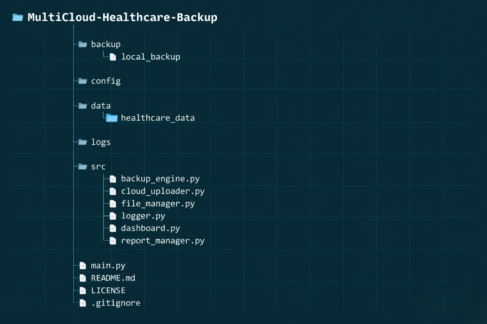
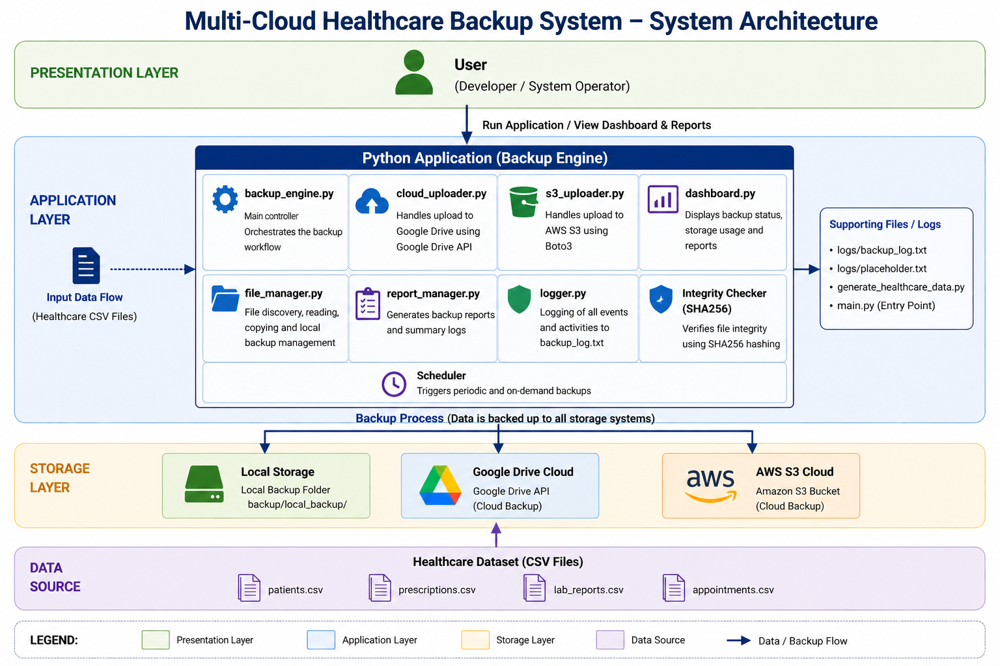

# Multi-Cloud Hybrid Strategy for Healthcare

## Project Overview

This project focuses on keeping healthcare data safe by storing it in multiple locations. Python is used to simulate a system that backs up healthcare data to different storage locations. This approach helps ensure data safety and system reliability.

The system stores healthcare files in both local storage and cloud storage to make sure the data is always available.

## Objectives

- Create a system that backs up healthcare data
- Use Python to back up data from multiple sources
- Demonstrate how redundancy and failover methods help keep data safe
- Ensure data safety using both local and cloud storage

## Technologies Used

- Python  
- Google Drive API  
- Local Storage  
- Git & GitHub  
- VS Code  

## Project Structure



## Key Features

- Automatic backup of healthcare files  
- Backup data from multiple sources (local and cloud)  
- Google Drive API integration for cloud storage  
- Data integrity verification using SHA256 hash  
- Retry mechanism if cloud upload fails  
- Failover system to keep data safe if cloud backup fails  
- Logging system to record all backup operations  
- Dashboard to display backup status  
- Scheduled backups that run automatically  

## System Architecture


...

## How the Backup System Works

1. Healthcare CSV files are stored in the dataset folder.  
2. The Python backup engine scans all healthcare files.  
3. Each file is copied to the backup directory.  
4. A SHA256 hash is generated to check data integrity.  
5. Files are uploaded to Google Drive using the Drive API.  
6. If the cloud upload fails, the system tries again automatically.  
7. If the retry still fails, the system keeps the data safely stored locally.  
8. All backup actions are recorded in the log file.  
9. The dashboard displays recent backup events.  
10. The scheduler can run backups automatically at set times.  

## Learning Outcomes

This project helps understand:

- Cloud computing reliability  
- Data redundancy  
- Failover systems  
- Cloud API integration  

## Future Enhancements

- Integration with AWS S3  
- Encryption for sensitive healthcare data  
- Automated scheduled backups  
- Web dashboard for monitoring backups  

## How to Run the Project

### 1. Clone the repository

```
git clone https://github.com/AdharvShyam/Multi-Cloud-Healthcare-Backup.git
```

### 2. Install dependencies

```
pip install google-api-python-client google-auth-httplib2 google-auth-oauthlib schedule
```

### 3. Generate healthcare dataset

```
python generate_healthcare_data.py
```

### 4. Run the backup system

```
python main.py
```

## Dataset

The project uses a simulated healthcare dataset that includes:

- Patient records  
- Appointment data  
- Lab reports  
- Prescription records  

The dataset is automatically generated using the script:

```
generate_healthcare_data.py
```

## Author

<table>
<tr>
<td align="center">

<b>Adharv Shyam</b><br>

<a href="mailto:adharvshyam.ai@gmail.com">adharvshyam.ai@gmail.com</a>

</td>
</tr>
</table>
